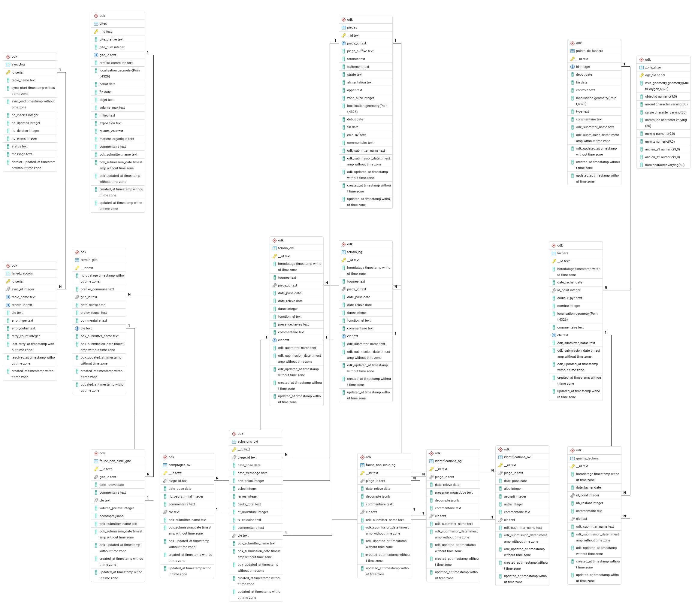

`r  options(rmarkdown.html_vignette.check_title = FALSE, width = 100)`
`r htmltools::img(src = knitr::image_uri("laveval.png"), alt = "Logo", style = "position:absolute;top:10px;right:5px;width:150px;")`   
<br>

# Introduction


L'estimation de la suppression des populations d'_Aedes albopictus_
exposées à la TIS renforcée est l'une des activités du Projet
d'Opérationnalisation de la Technique de l'Insecte Stérile renforcée
(OpTIS, financé par La Région de La Réunion et par la Commission
Européenne). Elle s'intègre dans la composante suivi / évaluation de
l'efficacité entomologique de ce projet.


# Objectifs de la vignette

Apprendre comment importer et sauvegarder les données du monitoring
des populations de moustiques exposées à la TIS renforcée, disponibles
dans la base de données Laveval, et nécessaiires pour estimer les
différentes densités de population de moustiques, ainsi que le taux de
suppression de ces populations.


# Définitions

1. La **suppression** d'une population de moustiques désigne les
   méthodes - notamment génétiques, visant à réduire, voire à éliminer
   localement ces moustiques[@Wilke2012]. La définition cet indicateur
   s'appuie sur celles des densités de population:
  
  + La **densité apparente** (_m_) est le nombre moyen d'individus
    capturés par piege - et type de piège, et pendant une période
    donnée.

  + La **densité attendue** (_E_) est la densité apparente observée dans
    un site témoin, avec le même type de piège et pendant la même
    période.

  + La densité relative ($\theta$) est le ratio de la densité
    apparente et de la densité attendue: $\theta = m / E$.
 
  + Le **taux de suppression** (_D_) est la densité relative, exprimée en
    proportion de la densité résiduelle par rapport à la densité
    initiale, dans une population de moustiques exposée à un programme
    de lutte pendant une période donnée : $D = 1 - \theta$.


```{r "setup", include = T}
knitr::knit_hooks$set(crop = knitr::hook_pdfcrop)
knitr::opts_chunk$set(include = T,
                      echo = T,
                      crop = T,
                      dev = 'png',
                      dev.args = list(pointsize = 14,
                                      type = "cairo",
                                      family = "serif"),
                      out.width = "100%")
 

library(lavsd)

```

# Le système d'information Laveval


```{r "mcd", fig.width=9, fig.cap=cap}

cap <- "Modèle conceptuel des données simplifié du système d'information Laveval"



```

Le [modèle conceptuel des
données](https://web.maths.unsw.edu.au/~lafaye/CCM/merise/mcd.htm) du
système d'information Laveval (fig. \@ref(fig:mcd)) donne une image de
la complexité des données à traiter et de leurs interactions. Laveval
est une base de données PostGIS/PostGreSQL, spécialisée dans la
gestion des données géographiques. Plusieurs packages et scripts R ont
été développés pour faciliter les tâches répétitives et fastidieuses
d'extraction des données et de préparation des tableaux d'analyse.


# Importation des données

## Donnnées géo-référencées


### Ligne de côte de La Réunion

```{r "run", echo = T}

utils::data('run',
            package = "lavsd",
            envir = environment()
            )


```

### zones Alizé 

```{r}

utils::data('za',
            package = "lavsd",
            envir = environment()
            )

Za <- za |>
    sf::st_transform(2975) |>
    base::subset(num_z %in% c(440, 437, 92, 46, 534,
                              1456, 325, 323, 45, 1455))
```

#### bsit1

```{r}

R1 <- base::subset(za, num_z %in% c(534, 1456)) |>
    sf::st_union() |>
    sf::st_geometry() |>
    sf::st_transform(2975) |>
    sf::as_Spatial()

```


#### bsit2

```{r}

R2 <- base::subset(za, num_z %in% c(45, 323, 325, 1455)) |>
    sf::st_union() |>
    sf::st_geometry() |>
    sf::st_transform(2975) |>
    sf::as_Spatial()

```

```{r}

R1R2 <- sf::st_as_sf(R1 + R2)

```


### pièges 

```{r}
## La table des pièges est disponible dans les données du package. 
utils::data('traps',
            package = "lavsd",
            envir = environment()
            )

## Dans Laveval, les pièges sont enristés coordonnées géographiquss
## (GPS WGS84): pour les analyses, ces coordonnées sont projetées dans
## le référentiel UTM de la Réunion: EPSG:2975
traps <- traps |>
    sf::st_transform(2975)

```

### Arrière-plan des cartes

```{r, fig.width = 9, dpi = 300}

utils::data("emprise",
            package = "lavsd",
            envir = environment()
            )

bkg <- getBkg(
    pos = c(.7, .06),
    scalem = 1000
)

ZA <- Za |>
    sf::as_Spatial()

## colonne qui sera affichée sur la carte
ZA$k <- 1

## définition de la légende
mykey <- list(
    space = "top",
    background = grey(.9),
    padding = 2,
    culumns = 2,
    text = list(
        c("Zone témoin",
          "Zone traitée"),
        cex = .6),
    rect = list(col = c(2, 3),
                alpha = .25,
                height = .6),
    text = list(
        c("Piège", ""),
        cex = .6),
    points = list(
        pch = c(19, NA),
        col = 4,
        cex = .6)
)

sp::spplot(ZA, zcol = "k",
           colorkey = F,
           col.regions = 2, alpha.regions = .25,
           key = mykey) +
    latticeExtra::as.layer(bkg, under = T) +
    latticeExtra::layer(sp::sp.polygons(R1, col = 3, lwd = 3,
                                    fill = 3, alpha = .25)) +
    latticeExtra::layer(sp::sp.polygons(R2, col = 3, lwd = 3,
                                    fill = 3, alpha = .25)) +
    latticeExtra::layer(sp::sppanel(sf::as_Spatial(traps),
                                col = 4, pch = 19, cex = .6))
                       


```


## Données non géo-référencées

### Données BGS

```{r}

data("bgs",
     package = "lavsd",
     envir = environment()
     )

str(bgs)

```


### Données ovitraps

```{r}

data("ovi",
     package = "lavsd",
     envir = environment()
     )

str(ovi)

```


# Nettoyage des données

## Oeufs

### Site traité `bsit1`

```{r}

t1o <- cleansd(ovi,
               treated = 'bsit1',
               end = Sys.Date()
               )

summary(t1o)

```

### Site traité `bsit2`

```{r}

t2o <- cleansd(
    ovi,
    treated = 'bsit2',
    end = Sys.Date()
)

summary(t2o)


```

## Femelles adultes

### Site traité `bsit1`


```{r "clean_falbo"}

## bsit1: 1ere et 2e phase
T1f <- cleansd(bgs,
               treated = 'bsit1',
               end = Sys.Date())

## ajout de deux dates "oubliées"
lev <- levels(T1f$period)
t1f <- dplyr::left_join(
                  ## pièges
                  sf::as_Spatial(traps)@data,
                  ## plan complet piège * date
                  expand.grid(
                      piege_id = factor(levels(T1f$piege_id)),
                      period = factor(
                          seq(as.Date(lev[1]),
                              as.Date(rev(lev)[1]),
                              by = "4 weeks"))),
                  by = dplyr::join_by(piege_id)) |>
    ## on garde bsit1 et les 2 zones témoin 
    base::subset(
                 subset = treatment != 'bsit2',
                 select = c("treatment", "piege_id", "period")) |>
    ## on ajoute les données disponibles en adant les données
    ## manquantes
    dplyr::left_join(
               T1f,
               by = dplyr::join_by(treatment, piege_id, period),
               keep = FALSE
           ) |>
    ## on élinmine les données sans intérêt et les valeurs vides des
    ## facteurs
    dplyr::filter(!is.na(period)) |>
    dplyr::mutate(
        treatment = factor(treatment),
        piege_id = factor(piege_id)
    )
## et voilà
summary(t1f)

```

### Site traité `bsit2`

```{r}

T2f <- cleansd(bgs,
               treated = "bsit2",
               end = Sys.Date()
               )

## on recommence
lev <- levels(T2f$period)
t2f <- dplyr::left_join(
                    sf::as_Spatial(traps)@data,
                    expand.grid(
                        piege_id = factor(levels(T2f$piege_id)),
                        period = factor(
                            seq(as.Date(lev[1]),
                                as.Date(rev(lev)[1]),
                                by = "4 weeks"))),
                  by = dplyr::join_by(piege_id)) |>
    base::subset(
                 subset = treatment != 'bsit1',
                 select = c("treatment", "piege_id", "period")) |>
    dplyr::left_join(
               T2f,
               by = dplyr::join_by(treatment, piege_id, period),
               keep = FALSE
           ) |>
    dplyr::filter(!is.na(period)) |>
    dplyr::mutate(
        treatment = factor(treatment),
        piege_id = factor(piege_id)
    )

## et voilà
summary(t2f)

```

# Densités apparentes

## Oeufs d'_Aedes_

```{r, fig.width = 9, fig.height = 6, fig.cap = cap}
## tableau avec toutess les données
eggs <- rbind(
    t1o,
    base::subset(
              t2o,
              subset = treatment == "bsit2")
)

## légende
cap <- paste0(
    "Densité apparente des oeufs d'_Aedes_ depuis le début du monitoring ",
    "dans les quatre sites suivis. Les deux lignes verticales indiquent ",
    "le début des lâchers de mâles stériles: le 26/08/2025 pour `bsit1`, ",
    "et le 05/03/2026 pour `bsit2`.")

## graphique
lattice::xyplot(
           m ~ as.Date(period),
             groups = treatment,
             subscripts = T,
             auto.key = T,
             data = eggs,
             xlab = "",
             ylab = "Densité apparente (#/piège/session",
             type = "b",
             panel = function(...){
                 lattice::panel.grid()
                 lattice::lpoints(..., pch = 1, lty = 0, grey(.8, alpha = .5))
                 lattice::panel.superpose(...,
                                 pch = NA,
                                 panel.groups = lattice::panel.average,
                                 horizontal = F)
                 lattice::panel.abline(v = as.Date(
                                  c("2025-08-29", "2026-05-05")),
                              col = "darkblue", lty = 4)
             }
         )
```


## Femelles adultes (_Aedes albopictus_)

```{r, fig.width = 9, fig.height = 6, fig.cap = cap}
## tableau avec toutess les données
falbo <- rbind(
    t1f,
    base::subset(
              t2f,
              subset = treatment == "bsit2")
)

## légende
cap <- paste0(
    "Densité apparente des femelles adultes (_Aedes albopictus_) depuis le ",
    "début du monitoring ",
    "dans les quatre sites suivis. Les deux lignes verticales indiquent ",
    "le début des lâchers de mâles stériles: le 26/08/2025 pour `bsit1`, ",
    "et le 05/03/2026 pour `bsit2`.")

## graphique
lattice::xyplot(
             m ~ as.Date(period),
             groups = treatment,
             subscripts = T,
             auto.key = T,
             data = falbo,
             xlab = "",
             ylab = "Densité apparente (#/piège/session",
             type = "b",
              panel = function(...){
                  lattice::panel.grid()
                  lattice::lpoints(..., pch = 1, lty = 0, grey(.8, alpha = .5))
                  lattice::panel.superpose(
                               ...,
                               pch = NA,
                               panel.groups = lattice::panel.average,
                               horizontal = F)
                  lattice::panel.abline(
                               v = as.Date(                  
                                   c("2025-08-29", "2026-05-05")),
                               col = "darkblue", lty = 4)
              }
         )
```

# Références

<div id="refs"></div>


# Contributeurs{-}

Equipe du projet OpTIS, volet entomologie

* Coordinateur du projet OpTIS : Jérémy Bouyer^1^ 

* Responsable Production d'_Aedes albopictus_ mâles stériles: Cécile
  Brengues^2^

* Insectarium IRD de Sainte-Clotilde: Waka Mamaï, Anthony Herbin^2^,
  Lise Monti^2^, Mathieu Whiteside^2^, Agnès Violet^1^

* Développement et estimation des indicateurs: Renaud Lancelot^1^, Mario Lopi^1^

* Développement base de données et gitlab LavEval: Vincent Delbar^3^,
  Renaud Lancelot^1^, Jérémy Bouyer^1^, Ronan Brouazin^1^, Alexandre
  L'Hostis^1^

* Echantillonnage et stratégie d'analyse : Renaud Lancelot^1^, Jérémy
  Bouyer^1^, Mario Lopi^1^, Cyril Voss^1^, Cécile Brengues^2^

* Collecte, saisie et gestion des données: Ronan Brouazin^1^,
  Alexandre L'Hostis^1^, Ophélia Devane^1^, Emmanuelle Hascoat^3^,
  Anthony Herbin^3^, Lise Monti^3^, Cyril Voss^1^, Agnès Violet^1^,
  Mathieu Whiteside^3^

* Pilotage du drone de lâcher automatique de mâles stériles: Stéphane
  Pic^4^

^1^ UMR Astre, Cirad - Inrae - Université de Montpellier, plateau
    technique du Cyroi, Sainte-Clotilde, La Réunion

^2^ UMR Mivegec, Ird - Cnrs - Université de Montpellier, plateau
    technique du Cyroi, Sainte-Clotilde, La Réunion

^3^ La TeleScop, Castelnau-le-Lez, France 

^4^Flying  Babouk https://www.flying-babouk.fr/"

# Financement

Ce travail a bénéficié du soutien des projets OpTIS et InterRiskOI,
cofinancé par le FEDER via l'Union européenne et la Région
Réunion. L'Europe s'engage pour La Réunion à travers le FEDER.

```{r, fig.width = 9}


```
